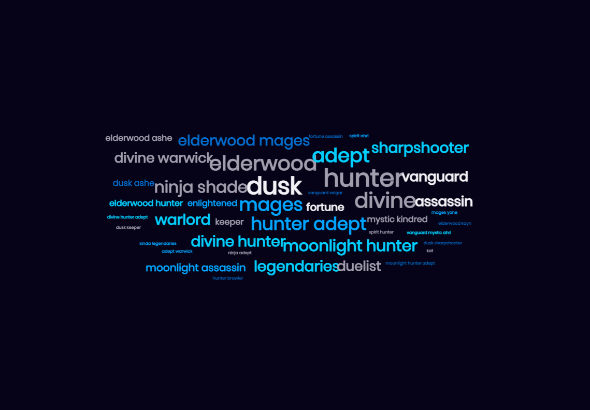
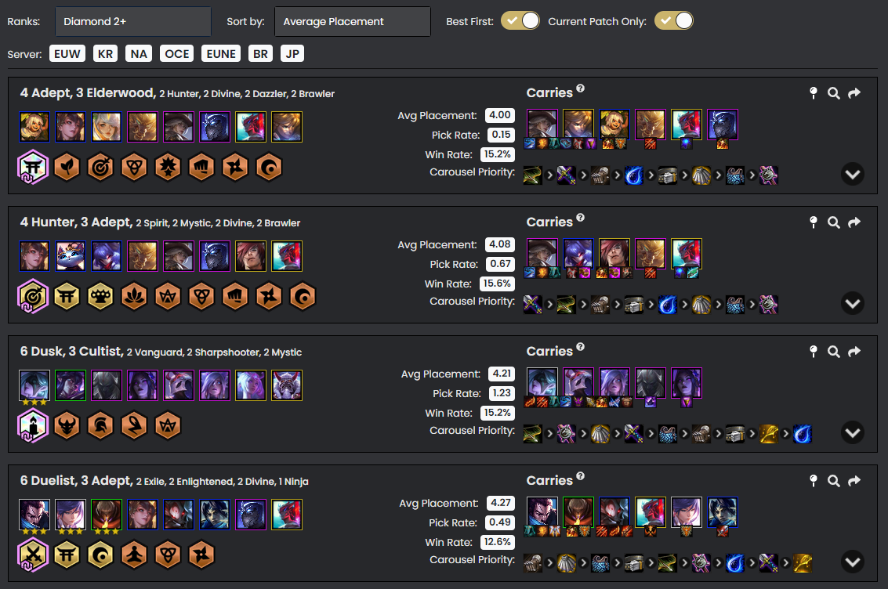

# TFT-Set4-EDA

## Introduction

Over the past five months, I have been very obsessed with the game, 'Teamfight Tactics' (or for short, TFT). TFT is an 'autochess' based game where you compete against seven other players to build a board of units to defeat every other player. There's a lot to this game, which I don't really want to spend a lot of time to talk about in detail, so I may just summarise some important information in a list of dot points:
- The objective of the game is to buy different units from a shop, place them on your board to defeat your opponents (who are doing the same thing).
- There are only five units per shop, however, you can always spend 2 gold to refresh for a new shop
- Each unit has at least one 'Origin' and one 'Class'. Having multiple units sharing the same 'Origin' or 'Class' often strengthens your team with synergy bonuses. These will vary depending on the set
- Each unit has a certain cost to them, ranging from 1 to 5 gold. Higher cost units are (most of the time) stronger than lower cost units, but will be rarer at lower levels. 
- There is a leveling system, ranging from 1 to 9. Increasing your level also increases the number of units you are allowed to have on your board
- The odds of finding certain units depend on your current level.
- In addition there are a set number of units available in the total pool (depending on the cost of the unit). If the many people are hoarding the same unit, it is less likely for you to find that unit in your shop.
- You may also equip your units with items. There are 9 basic items which give your unit a certain boost in stats (attack, defense, spell power etc.)
- You can combine any two basic items to create a stronger item. There are a total of 45 of these items, each with their unique ability.

That's just some of the basic ideas of the game. There is a lot more to the game once you understand the basics, ranging from playstyles, game flow, composition structures and so on. A combination of all these ideas make the game extremely fun to play. 

## EDA
In the whole dataset collected, there are a total of 555 different games of TFT played over the course of about four months (from mid September to present). TFT is a game which regularly has balance patches to ensure that the 'best units', 'best compositions', and 'best items' don't stay constant, and will keep the compeitive side of the game more interesting. As a result, I have decided to limit my analysis to a single patch - 10.25 (spanning from December 9 2020 to January 5 2021). This patch was chosen because it was the longest span of time without balance patches (the balance team was on holidays). This also meant that I personally played a lot of games, making the findings more interesting. In addition, since the most recent balance patch (as of writing this blogpost) has not changed the meta too drastically, it may also help me with my climb to Grandmaster (UPDATE: It did help). 

### Sample data
Here's a sample of the dataset:
|  | __Date__ | __Patch__ | __Account__ | __Starting Item__ | __Chosen__ | __Comp__ | __Place__ | __Rank__ | __LP__ | __LP Diff__ | __Winning Comp (if saw)__ | __Comment__ | __Week__ | __chosen_trait__ | __chosen_unit__ |
|-:|-:|-:|-:|-:|-:|-:|-:|-:|-:|-:|-:|-:|-:|-:|-:|
| 527 | 2021-01-03 | 10.25 | phillipluong | Cloak | Duelist Yasuo | 6 Duelists | 5 | M1 | 366 | -10.0 | NaN | no yone :(; I probably should've rolled for yo... | 4 | Duelist | Yasuo |
| 528 | 2021-01-03 | 10.25 | phillipluong | Bow | Assassin Akali | Ninja Shade | 8 | M1 | 356 | -42.0 | NaN | that game felt so doomed; that kench did nothi... | 4 | Assassin | Akali |
| 529 | 2021-01-03 | 10.25 | phillipluong | Tear | Mystic Cassie | 4 Dusk 4 Sharpshooters | 7 | M1 | 314 | -27.0 | NaN | sold my fortune before I cashed out…............, | 4 | Mystic | Cassie |
| 530 | 2021-01-03 | 10.25 | phillipluong | Rod | Warlord Garen | 9 Warlords | 4 | M1 | 287 | 10.0 | NaN | NaN | 4 | Warlord | Garen |
| 531 | 2021-01-03 | 10.25 | phillipluong | Sword | none | Divine Hunters | 7 | M1 | 297 | -38.0 | NaN | should've gotten dazzler morgana; the items we... | 4 | none | none |

### Column Descriptions
There are a total of 15 columns in the data, comprising of the former 12 that were filled out as I played each game, and the latter 3 created for the analysis. I will now explain the details of these columns:

| Col Name | Column Description | Data Type |
|:-|-|:-|
| Date | The date that the game was played | datetime64[ns] |
| Patch | The Balance Patch the game was played on | object |
| Account | Since I played 2 active accounts, I keep track of which of the two accounts I played on | object |
| Starting Item | What item did I start the game with | object |
| Chosen | The chosen unit I had by the end of the game | object |
| Comp | A brief description of the composition I ran | object |
| Place | My placement at the end of the game (ranging from 1st to 8th) | object |
| Rank | The Rank I was at during the game (Ranging from Iron 4 (I4) to Grandmaster (GM1) | object |
| LP | The amount of 'League Points' I was at before the game. This determines my overall rank | int64 |
| LP Diff | The change in my LP after I finished the game | float64 |
| Winning Comp (if saw) | I would sometimes write the winning composition if I followed the game until the end | object |
| Comment | A comment on the game (if I had one) | object |
| Week | Which week of the patch this game was played (week 1-4). This only applied for patch 10.25 since the patch ran for 4 weeks | int64 |
| chosen_trait | A specific breakdown of the trait (origin/class) of the chosen unit | object |
| chosen_unit | A specific breakdown of the chosen unit itself | object |

## Primary Statistics
Over the span of 4 weeks, a total of 134 games were played. All of these games were played on accounts that were of 'Masters' Rank or above (the top 0.36% of the playerbase). Through this time, my primary account, _phillipluong_, dropped from 430 League Points (LP) to 259 LP (mostly on the last day). Meanwhile, my secondary account, had increased from 144 LP to 404 LP. This means there was a total increase of 89 LP over the four week period (equivalent to two 1st place finishes). Over the 134 games, there were a fairly even amount of placements over the period.

Notably, there are far fewer 1st and 8th placements compared to all other rankings. I had a 8.96% win rate (12/134), which is much lower than the expected 12.5% winrate. Conversely, my loss rate was also 8,96%, which shows that I did quite well to prevent the maximal LP loss each game. Also of note, you always gain at least 10 LP for coming in the top 4. Over the four weeks, I had a 69/134 top 4 placement rate (51.49%), which is better than the expected rate. 

- Wins were mostly collected from playing: Dusk, Hunter Adept, Ninja Shade, and Legendary Comps. There was also 1 win from 9 elderwood. 
- Top 4 Comps also included: 9 Mages, Divine Hunters, Enlightened, Moonlight Reroll 

Here's a word cloud of my personal summary of the compositions I played. Since I consider myself a 'semi-flexible' player, the descriptions of my compositions will differ depending on the kind of units that appear in my shop. 

## Analysis based on weeks and Accounts

### Analysis each week

My gameplay wasn't always the same each week (hopefully, it's all in part of a steady improvement). Regardless, there were definitely some weeks where I performed better than others, as shown by these summary statistics:

| Week No. | Games Played | Wins (%) | Top rate (%) | mean placements (SD) | median placements (IQR) | LP Diff |
|-|-|-|-|-|-|-|
| Week 1 | 43 | 6 (13.95%) | 25 (58.14%) | 4.16 (2.13) | 4 (3-6) | +202 |
| Week 2 | 23 | 1 (4.35%) | 12 (52.17%) | 4.65 (2.10) | 4 (3-6) | -40 |
| Week 3 | 40 | 4 (10%) | 23 (57.5%) | 4.08 (2.09) | 4 (2-6) | +239 |
| Week 4 | 28 | 1 (3.57%) | 9 (32.14%) | 5.32 (2.18) | 5.5 (4-7) | -312 |

On average, I played 33.5 games per week. Notably, I played more games and had a higher win rate on weeks 1 and 3, rather than weeks 2 and 4. In addition, I only had a higher than expected win rate in Week 1, at 13,95% (instead of the expected 12.5%). 

### Analysis based on Account

- phillipluong: 79, ILoveAnt: 55
- Average placements: 4.67, 4.16
- Median Placement: 5, 4
- Placement plot for each account 

Overall, it appeared that my gameplay was better on the 'ILoveAnt' account rather than my primary account, 'phillipluong'. I believe that the clear reason may likely be because 'ILoveAnt' started off playing games against lower ranked users, thus increasing its odds of winning or appearing in the Top 4.

If I removed the games 'ILoveAnt' played after hitting 300 LP, here are the results:

In addition, there was indeed a day where I played in the account 'phillipluong' and ran it all the way down, after I was about 1 game off hitting Grandmaster. Here are the details of my account if we remove that period:

### Analysis based on Account, by week
__ILoveAnt:__

| Week No. | Games Played | Wins (%) | Top rate (%) | mean placements (SD) | median placements (IQR) | LP Diff |
|-|-|-|-|-|-|-|
| Week 1 | 21 | 5 (23.81%) | 14 (66.67%) | 3.76 (2.32) | 3 (2-6) | +221 |
| Week 2 | 15 | 1 (6.67%) | 10 (66.67%) | 4.33 (2.41) | 3 (3-6) | +40 |
| Week 3 | 15 | 2 (13.33%) | 9 (60%) | 4.06 (2.15) | 4 (2.5-6) | +87 |
| Week 4 | 4 | 1 (25%) | 1 (25%) | 6.00 (1.82) | 6 (4.75 - 7.25) | -88 |

__phillipluong:__

| Week No. | Games Played | Wins (%) | Top rate (%) | mean placements (SD) | median placements (IQR) | LP Diff |
|-|-|-|-|-|-|-|
| Week 1 | 22 | 1 (4.54%) | 11 (50%) | 4.55 (1.89) | 4.5 (3-6) | -19 |
| Week 2 | 8 | 0 (0%) | 2 (25%) | 5.25 (1.28) | 5.5 (4.75-6) | -80 |
| Week 3 | 25 | 2 (8%) | 14 (56%) | 4.08 (2.10) | 4 (2-6) | +152 |
| Week 4 | 24 | 1 (4.17%) | 8 (33.33%) | 5.20 (2.25) | 5.5 (3.75 - 7) | -224 |

I was also curious on my performance of each account, per week. I wouldn't say that there were any drastic changes per account, per week. From what it looks like, the final week was probably that only 'drastic' difference. The account, 'ILoveAnt' had some steady progression throughout each week, besides week 4. Conversely, philipluong only really made a lot of success in Week 3 and lost LP every other week. 

### Analysis based on starting item
- There is basis that the starting item normally dictates the flow of the game, and hence, may be a good determinant of the overall placement. I would tend to agree with this idea, especially after looking at my own data. 

Traditionally, the more 'popular' items to collect in this patch appeared to be: Tears and Swords, tben Rods, Gloves, Bows and finally Cloaks, Vests and Belts. These patterns are often associated with the strongest kinds of compositions often being played at the time. In this patch, the data was leaning towards compotiions that played around Jhin, Ashe, Veigar, Riven, and sometimes, Zed. Many of these units would prefer Sword-based items (Jhin, Ashe), whilst some users prefered magic damage items (like Riven and Veigar). Compositions based around Zed were reliant on a lot of bows. 

[Analyse this part]

[Analyse this part]

## Analysis based on the _Chosen_ mechanic

### Analysis based on the _Chosen_ trait

### Analysis based on key _Chosen_ units

### Analysis of winning and top 4 comps

## Future Directions

There are a handful of things that can be done to progress this EDA in the future, namely relating to the data categorisation and data collection aspect.

When it comes to data collection, there could be some way to use the Riot Games API to collect a list of all the teams I have used (and maybe the teams my opponents used) in each game. That way, I can then determine which units I perform well with and against (and vice versa). A couple of analytic tools already accomplish such a feat already, such as tactics.tools, which allow me to analyse my performance on the last 20, 50, and 100 games. 

In addition, I wish to potentially replicate this EDA using SQL in order to develop my SQL toolbox. Hopefully, by learning SQL, I will also figure out new findings I can get from the same dataset.

Game-wise, I have very much been enjoying the changes in the 'meta' of the game, and hope to continue climbing the ladder. Recently, I have managed to finally reach one of my bigger goals for playing the game, which was to hit the 'Grandmaster' title (meaning that I am in the top 150 players in the Oceania server). 

Very soon, there will be a huge balance patch, which changes out 20 characters for new ones, completely changing the flow of the game. Along with these changes, my short-term goal is to hit the top 100 in the Oceania Server, then maybe hit top 50 (giving me the Challenger title).  

## Other Resources

A huge thanks to a bunch of external tools that I regularly use to help my climb and feed my craving for data in TFT. These tools have incredible information taken from the Riot Games API and have a great User Interface. These include:

- lolchess.gg
- tactics.tools
- metatft.com
- tftactics.gg
- the competitive tft reddit site

Many of these tools have include a lot of analyses that I wish to incorporate myself, including analysing which units to use, combinations of units statistically work well together and which items that work better with units. I have a bunch of snapshots below from some of these websites that include information that I find extremely helpful and useful. 

